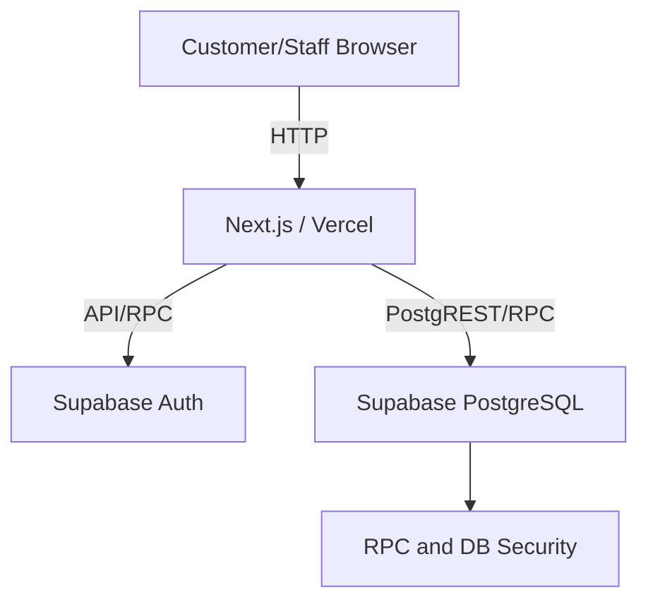
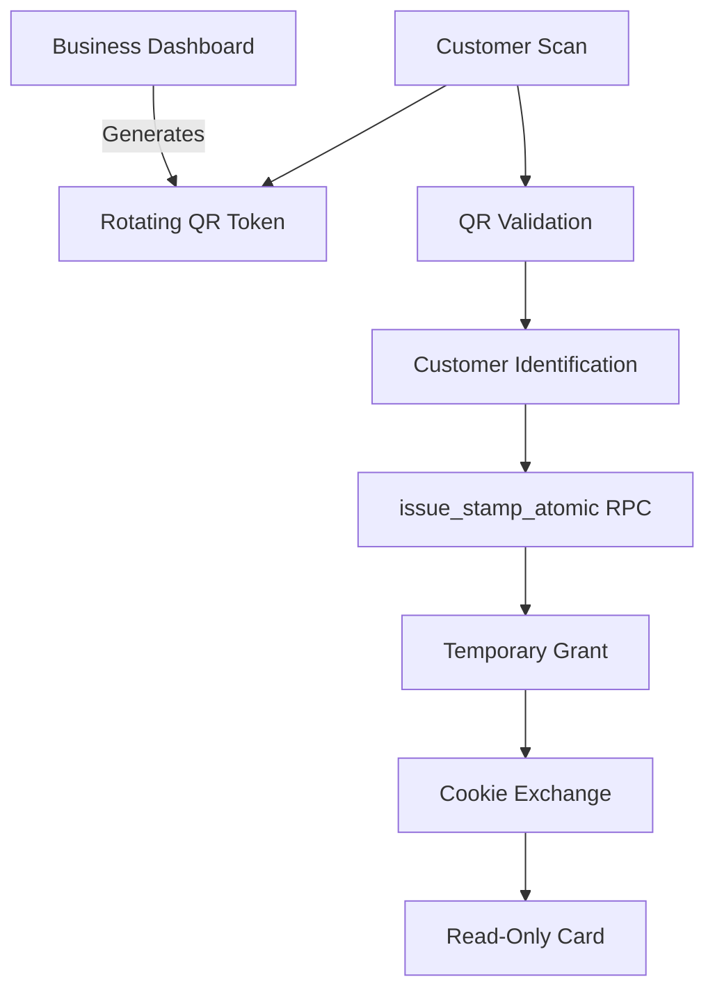
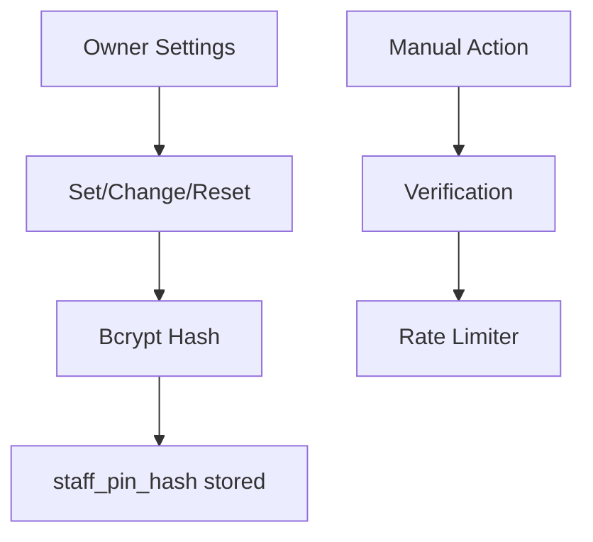
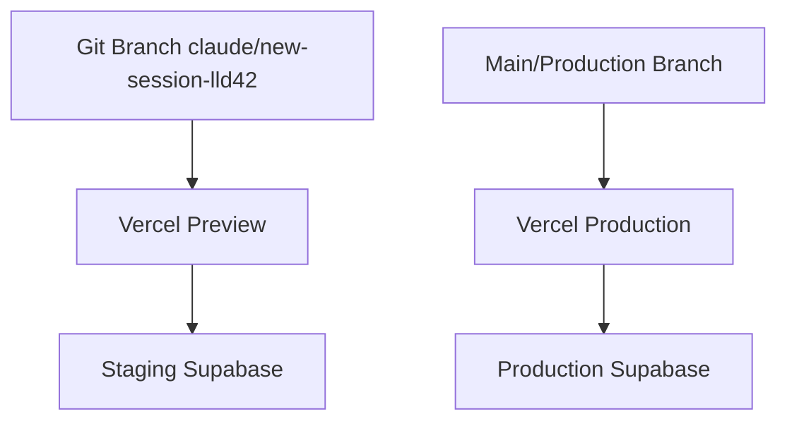

# Technical Requirements Document (TRD)

## 1. System Architecture
IntelliStamp is built on a serverless web architecture utilizing Next.js, Vercel, and Supabase. The application enforces strong isolation between public/customer routes and protected/business routes.

## 2. Technology Stack
- **Framework**: Next.js 14 (App Router)
- **Database**: Supabase (PostgreSQL)
- **Authentication**: Supabase Auth
- **Hosting**: Vercel
- **Styling**: Tailwind CSS
- **Testing**: Jest

## 3. Repository Structure
- `/src/app`: Next.js App Router structure.
- `/src/app/(auth)`: Business authentication routes.
- `/src/app/(business)`: Dashboard routes.
- `/src/app/(customer)`: Public customer scanning and card views.
- `/src/app/api`: Serverless API handlers.
- `/src/components`: Reusable React components.
- `/src/lib`: Core utilities (auth, tokens, rate limit).
- `/src/types`: TypeScript definitions.

## 4. Next.js Application Structure
Utilizes React Server Components where possible for enhanced performance and security, coupled with API route handlers for state-mutating requests.

## 5. Supabase Architecture
- Leverages Row Level Security (RLS) to enforce tenant isolation at the database level.
- Makes heavy use of stored procedures (RPCs) for atomic transactions that require locking or complex multi-table orchestration.

## 6. Database Tables
- `businesses`: Core tenant record.
- `customers`: Associated users scoped to a specific business.
- `stamps`: Immutable ledger of earned stamps.
- `milestones`: Business configuration for rewards.
- `rate_limits`: Tracks endpoint abuses.

## 7. Authentication Model
Business owners are authenticated using Supabase Auth (Session/Cookie based). Customers are completely unauthenticated in the traditional sense, relying strictly on ephemeral signed tokens and HttpOnly session cookies for temporary card views.

## 8. Authorization Model
Enforced via helper middleware (`requireUser`, `requireBusiness`) which resolve permissions strictly server-side before processing requests.

## 9. Tenant Isolation
Every customer and stamp record maps directly to a `business_id`. RLS policies ensure that the authenticated owner can only query data matching their business.

## 10. API Route Catalogue
- Business operations (`/api/business/*`)
- Customer operations (`/api/customer/*`)
- Kiosk/Staff operations (`/api/kiosk/*`)
- Stamp operations (`/api/stamp/*`)
*See `docs/04_API_REFERENCE.md` for specifics.*

## 11. QR-Token Design
QR codes embed a signed payload generated using a server-side `QR_SECRET_KEY`.
Payload includes:
- `businessId`
- `timestamp`
- `nonce`
- `signature` (HMAC-SHA256)

## 12. Atomic Stamp Transaction
The `issue_stamp_atomic` RPC orchestrates stamp generation securely. It uses PostgreSQL advisory locks to prevent race conditions during rapid concurrent requests and enforces strict cooldown logic.

## 13. Rate-Limit Design
A database-backed rate-limiting table prevents brute forcing (e.g., Staff PIN attempts). It uses HMAC-derived keys to protect the identity of the rate-limited entity and adheres to a fail-closed model.

## 14. Staff PIN Hashing and Verification
Staff PINs are hashed using `bcrypt` and stored in `staff_pin_hash`. The raw PIN is never stored or exposed. Verification happens entirely server-side.

## 15. Read-Only Card Access Grants
A temporary, 5-minute grant generated post-stamp. Contains a `view_card` scope explicitly restricting the user from mutating data or executing redemptions.

## 16. Cookie Exchange Flow
The access grant is exchanged via a server-side endpoint for an HttpOnly cookie, protecting the short-lived session against client-side XSS attacks.

## 17. Environment Variables
- `NEXT_PUBLIC_SUPABASE_URL`
- `NEXT_PUBLIC_SUPABASE_ANON_KEY`
- `SUPABASE_SERVICE_ROLE_KEY`
- `NEXT_PUBLIC_APP_URL`
- `RATE_LIMIT_KEY_SECRET`
- `QR_SECRET_KEY`
- `ACCESS_GRANT_SECRET`

## 18. Vercel Deployment Model
Automatically deployed via Vercel GitHub integrations.

## 19. Preview versus Production Separation
- **Preview**: Uses Staging Supabase and Preview Vercel Environment Variables.
- **Production**: Uses Production Supabase and strictly isolated variables.

## 20. Error Handling
APIs return standardized JSON structures. Fail-closed logic is implemented on all security endpoints.

## 21. Logging Policy
Sensitive data (PINs, passwords, hashes) are strictly excluded from all server logs.

## 22. Security Controls
- No client-side trust of `business_id`.
- Constant-time signature comparison for tokens.
- Parameterized SQL / Supabase ORM usage.

## 23. Testing Architecture
A comprehensive Jest suite covers Unit, API, Integration, and Security scenarios.

## 24. Build Pipeline
Vercel handles Next.js builds. Local builds run `npm run lint` and `npx tsc --noEmit` alongside tests.

## 25. Migration Process
Supabase CLI is used to deploy SQL schema changes to Staging, followed by Production upon verification.

## 26. Rollback Approach
Revert code via Git and rely on forward corrective migrations for database structure. Avoid destructive blind DB rollbacks.

## 27. Operational Limitations
No multi-region failover implemented natively yet. Rate limit tables require periodic cleanup.

## 28. Technical Debt
Grant-exchange URL exposes the grant momentarily in the query string prior to the redirect scrub.

## 29. Future Architecture
Transition to POST-body grant exchange to completely eliminate URL parameter leakage.

---

## Diagrams

### A. High-level architecture

### B. QR stamp flow

### C. Staff PIN flow

### D. Environment separation

*(Do not mix staging and production arrows)*
