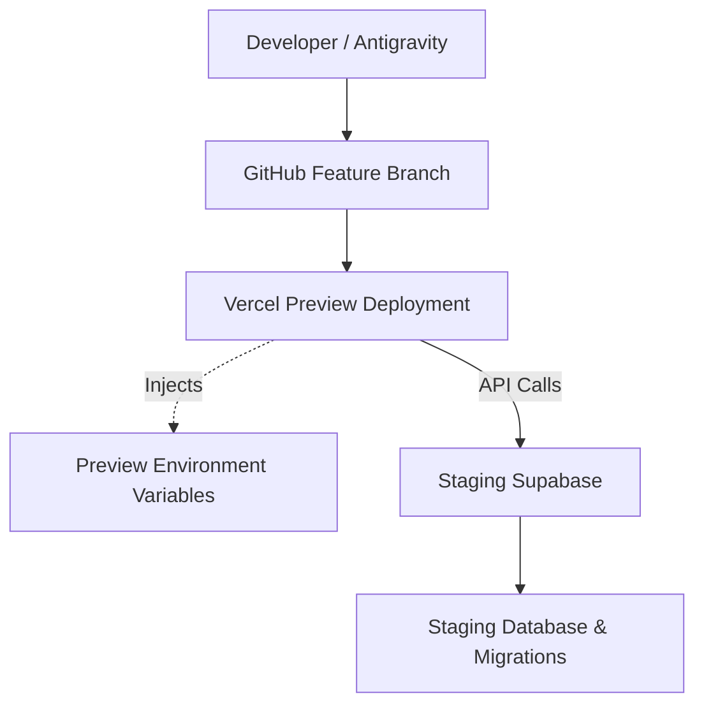

# IntelliStamp Staging Environment — Setup, Operations and Testing Guide

## 1. PURPOSE OF STAGING
The Staging Environment is a safe, isolated replica of production. It is used to:
- Apply and validate structural database migrations.
- Test QR, customer, and staff interaction flows end-to-end.
- Validate security fixes (like atomic stamping and rate limiting).
- Deploy branch previews via Vercel.
- Test mobile behavior across real devices.
- **Strictly avoid touching production data or configurations.**

## 2. CURRENT STAGING COMPONENTS
- **GitHub Repository**: `aibotmate-code/Intellistamp`
- **Staging Branch**: `claude/new-session-lld42`
- **Vercel Project**: `intellistamp-inte`
- **Supabase Staging Project**: `Intellistamp Staging`
- **Supabase Staging Project Reference**: `ukbsbtlsjrotwnbephbh`

*(Note: No secret values are documented here.)*

## 3. ENVIRONMENT ARCHITECTURE

Production remains completely isolated with separate credentials, environment variables, and branch logic.

## 4. HOW THE STAGING ENVIRONMENT WAS CREATED
Reproducible steps taken to establish staging:
1. Created a separate Supabase staging project.
2. Captured the project URL and public anon key.
3. Captured the `service_role` key securely.
4. Configured Vercel Preview environment variables for the branch.
5. Bound the Preview deployment to use Staging credentials strictly.
6. Applied staging migrations in numeric order via Supabase CLI.
7. Verified migration permissions, RLS policies, and RPC functions.
8. Redeployed Preview after environment-variable changes to flush caches.
9. Confirmed that the Preview application uses Staging and not Production.

## 5. PREVIEW ENVIRONMENT VARIABLES
| Variable | Public/Server-only | Purpose | Environment |
|---|---|---|---|
| `NEXT_PUBLIC_SUPABASE_URL` | Public | Staging Supabase URL | Preview |
| `NEXT_PUBLIC_SUPABASE_ANON_KEY` | Public | Staging Anon Key | Preview |
| `SUPABASE_SERVICE_ROLE_KEY` | Server-only | Secure backend DB access | Preview |
| `NEXT_PUBLIC_APP_URL` | Public | Base URL for redirects/APIs | Preview |
| `RATE_LIMIT_KEY_SECRET` | Server-only | HMAC secret for rate limits | Preview |
| `QR_SECRET_KEY` | Server-only | HMAC secret for QR signing | Preview |
| `ACCESS_GRANT_SECRET` | Server-only | HMAC secret for temporary cards | Preview |

**Strict Environment Rules**:
- Server secrets must **never** use the `NEXT_PUBLIC_` prefix.
- Secrets must **never** be committed to the repository.
- Secret values must **not** appear in screenshots, logs, or documentation.
- Changing a Vercel variable requires an active redeployment to take effect.
- Preview and Production must use entirely different randomly generated values.

## 6. SECRET GENERATION
Generate secrets independently using safe cryptographic tools. Never reuse them.
*PowerShell example:*
```powershell
[Convert]::ToBase64String((1..48 | ForEach-Object { Get-Random -Maximum 256 }))
```

## 7. MIGRATION APPLICATION
Migrations are:
- Reviewed locally for destructive actions.
- Applied to Staging only (never directly to Production).
- Verified via SQL queries ensuring schema changes exist.
- Tested for RLS enforcement and execution permissions (`SECURITY DEFINER`).
- Recorded in documentation after success.
- Production application requires entirely separate manual approval.

Current migration order:
1. `20260802000000_issue_stamp_atomic.sql`
2. `20260802010000_rate_limit.sql`
3. `20260802020000_staff_pin_backfill.sql`

## 8. BRANCH AND DEPLOYMENT FLOW
- Developers (or Antigravity) edit and test code locally.
- Changes are committed to `claude/new-session-lld42`.
- Pushing to GitHub triggers a Vercel Preview deployment automatically.
- Preview environment variables are injected during the build phase.
- The Preview app talks **only** to Staging Supabase.
- **Rule**: No merging to the main branch during staging work.
- **Rule**: No production promotion occurs without explicit manual approval.

## 9. HOW STAGING OPERATES
### Business Dashboard
- Authenticated owner logs in via Supabase.
- Dashboard loads staging data exclusively.
- A rotating QR is generated using the Preview `QR_SECRET_KEY`.
- QR refreshes dynamically in the UI.

### Customer Flow
- Phone scans the Preview QR code.
- Server validates the QR signature securely.
- Customer is identified or created within the Staging tenant.
- Atomic RPC (`issue_stamp_atomic`) evaluates cooldown and issues the stamp.
- A grant is generated using the Preview `ACCESS_GRANT_SECRET`.
- The grant is exchanged for a temporary HttpOnly cookie.
- The read-only card view is displayed.

### Staff Flow
- Pro-plan businesses configure the PIN.
- PIN is stored strictly as a bcrypt hash.
- Manual dashboard operations verify the PIN when the validator is enabled.
- Incorrect attempts are logged in the Staging rate-limit table.

## 10. TEST DATA RULES
- Use fake names and test phone numbers (e.g., `+15550001111`).
- **Never** copy real production customer data to Staging.
- Avoid inputting personal identifiable data.
- Label test businesses clearly (e.g., "Staging Cafe").
- Periodically clean staging data to prevent buildup.
- Do not reuse production authentication tokens or session cookies.

## 11. DAILY OPERATION CHECKLIST
- [ ] Verify you are on the correct branch (`claude/new-session-lld42`).
- [ ] Verify the latest commit hash matches expectations.
- [ ] Verify the Vercel Preview deployment completed successfully.
- [ ] Verify Preview environment variables are correct in Vercel.
- [ ] Confirm Staging Supabase reference (`ukbsbtlsjrotwnbephbh`).
- [ ] Confirm absolutely no production changes occurred.
- [ ] Run basic smoke tests (UI load, Login).
- [ ] Review Vercel deployment and runtime logs.
- [ ] Record test evidence.

## 12. ENVIRONMENT-CHANGE CHECKLIST
When modifying a Vercel variable:
- [ ] Add to Preview environment only.
- [ ] Confirm correct spelling (case-sensitive).
- [ ] Confirm server/public classification (no `NEXT_PUBLIC_` for secrets).
- [ ] Save configuration.
- [ ] Redeploy the latest commit in Vercel.
- [ ] Inspect deployment logs for variable pickup.
- [ ] Run the affected application flow.
- [ ] **Never** paste the variable value into chat, logs, or GitHub.

## 13. MIGRATION CHECKLIST
- [ ] Confirm Supabase project reference is Staging.
- [ ] Review SQL for destructive commands.
- [ ] Back up Staging if data loss is a concern.
- [ ] Run migration via CLI or Supabase Dashboard on Staging.
- [ ] Verify schema updates in Table Editor.
- [ ] Verify RLS policies and permissions.
- [ ] Verify RPC execution roles (`SECURITY DEFINER`).
- [ ] Run automated application tests.
- [ ] Document outcome.
- [ ] **Do not** apply to production automatically.

## 14. TROUBLESHOOTING
| Symptom | Likely cause | Safe diagnostic | Resolution |
|---|---|---|---|
| Preview asks for Vercel login | Vercel Protection enabled | Check Vercel project settings | Disable Vercel Authentication for the Preview branch or login. |
| QR is blank | `QR_SECRET_KEY` missing | Check Vercel Runtime logs for 503 | Add secret and redeploy Preview. |
| QR returns 401 | Expired or forged token | Check scan timing/URL | Rescan fresh QR immediately. |
| Correct PIN reported invalid | Variable missing or DB lag | Check network tab payload | Ensure `RATE_LIMIT_KEY_SECRET` exists. |
| Staff PIN toggle is OFF | Validator not enabled | Check DB `businesses` table | Turn toggle ON in dashboard settings. |
| Free plan cannot set PIN | Entitlement block | Check business `plan` field | Switch business to 'pro' plan. |
| Cookie does not appear | Browser blocking third-party | Inspect browser Application tab | Ensure accessing the URL directly (not embedded iframe). |
| Card-access grant expired | Took > 5 mins to load | Check URL timestamp | Rescan QR for a fresh grant. |
| Preview connected to Production | Wrong env variables | Check `NEXT_PUBLIC_SUPABASE_URL` | Fix variables and **redeploy immediately**. |
| Migration fails (NOT NULL) | Legacy null data | Check DB columns | Write corrective pre-migration (e.g. `DROP NOT NULL`). |
| Vercel redeploy did not update | Caching | Check Vercel build output | Manually trigger a completely new deployment without cache. |

## 15. RELEASE/PROMOTION PROCESS
Moving from Staging to Production strictly requires:
- 100% pass rate on the complete automated test suite.
- Zero failed security tests.
- End-to-end customer QR test success.
- Manual Staff PIN flow test success.
- Reward flow test success.
- Technical review of all SQL migrations.
- Documented production backup and rollback plan.
- **Explicit owner approval.**
- Separate verification of production environment variables.
- Post-deployment production smoke test.

## 16. ROLLBACK
If a deployment fails:
- Revert the application commit via Git.
- Redeploy the previous known-good commit via Vercel.
- **Avoid** reversing SQL migrations blindly (dropping tables).
- Write and deploy forward corrective migrations where appropriate.
- Record the reason for the rollback.
- Verify tenant data integrity.

## 17. CURRENT STATUS
- Staging migrations applied and fully verified.
- Preview secrets configured securely.
- QR rendering and server-side authentication fixed.
- Atomic stamp flow (with DB locking) implemented.
- Database-backed rate limiting implemented.
- Plaintext Staff PIN migration completed safely in Staging.
- Signed QR customer flow successfully bypasses Staff PIN.
- Temporary read-only card access implemented (HttpOnly cookie flow).
- Staff PIN management (Set/Change/Reset) implemented and gated by plan.
- Automated suite (29 suites) passing perfectly.
- **Production remains untouched.**
- Final broader pilot and production release approval remain separate, pending steps.
