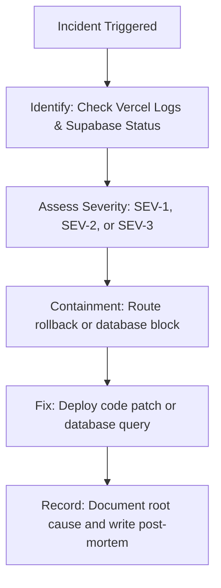

# IntelliStamp Production Incident Response SOP

---

## 1. Incident Severity Classification

* **SEV-1 (Critical Status):**
  - *Criteria:* Complete platform outage; customers cannot scan/issue stamps; database is down; authentication is broken.
  - *SLA:* Immediate response (within 15 minutes).
* **SEV-2 (Degraded Status):**
  - *Criteria:* Branding uploads are failing; CSV exports are timing out; WhatsApp notifications are delayed.
  - *SLA:* Response within 2 hours.
* **SEV-3 (Minor Status):**
  - *Criteria:* Dashboard metrics are slightly delayed; minor styling/alignment issues.
  - *SLA:* Resolved during next release cycle.

---

## 2. Standard Incident Resolution Workflow



---

## 3. Production Diagnostic & Health Check Queries

Execute these queries in the Supabase SQL editor to identify health anomalies:

### Query A: Monitor Connection Spikes & System Health
```sql
SELECT pid, age(clock_timestamp(), query_start), usename, state, query
FROM pg_stat_activity
WHERE state != 'idle'
ORDER BY age DESC;
```

### Query B: Track High-Frequency Error Logs or Failed Stamp Events
```sql
SELECT customer_id, business_id, count(*) as count
FROM public.stamps
WHERE stamped_at > now() - INTERVAL '1 hour'
GROUP BY customer_id, business_id
HAVING count(*) > 5;
```

### Query C: Identify OTP Spikes (Brute force attempts)
```sql
SELECT phone, count(*) as attempt_count
FROM public.otp_store
WHERE created_at > now() - INTERVAL '15 minutes'
GROUP BY phone
HAVING count(*) > 5;
```

---

## 4. Production Issue Incident Template

When documenting production issues, open a ticket with the following template:

```markdown
### 🚨 incident Summary
- **Incident ID:** INC-YYYYMMDD-[Num]
- **Severity Level:** [SEV-1 / SEV-2 / SEV-3]
- **Service Affected:** [Stamping API / Dashboard / Supabase DB]
- **Start Time:** YYYY-MM-DD HH:MM UTC

### 🕵️ Symptom Description
Describe the issue observed by customers or owners (e.g. 500 errors on stamping).

### 🔍 Root Cause Analysis
Explain the underlying issue (e.g., database connection pool exhaustion).

### 🛠️ Containment & Mitigation Actions
1. Reverted deployment to build version `[commit-hash]`.
2. Applied database rollback queries.

### 📝 Action Items to Prevent Replay
- [ ] Add rate limiter to [endpoint].
- [ ] Hardened RLS policies.
```
