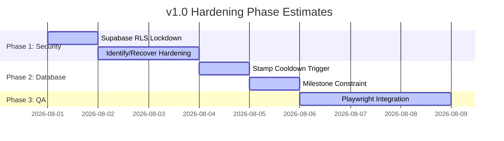

# IntelliStamp v1.0 Production Readiness Audit
**Author:** QA Lead & Database Reliability Engineer  
**Status:** DRAFT (Awaiting Approval)  
**Target Version:** v1.0.0 (Controlled Pilot)

---

## Executive Summary
This document provides a thorough audit of the IntelliStamp platform prior to the planned v1.0 controlled production pilot. While the core business onboarding, dynamic QR generation, staff validation, and campaign drafting function correctly, the audit has identified **critical security vulnerabilities (P0)** and **concurrency flaws** that must be resolved before any real-world pilot deployments.

### Key Metrics
* **Current Production Readiness:** **60%**
* **P0 Blocker Count:** **3**
* **P1 Hardening Count:** **4**
* **Recommended Pilot Verdict:** **Do Not Deploy** until P0 blockers are resolved.

---

## PART 1 — IntelliStamp v1.0 Scope Definition

### Feature Inventory & Classification

| Feature Area | Technical Components | Classification | Description & Gap Analysis |
| :--- | :--- | :--- | :--- |
| **Business Owner Auth** | `/(auth)/login`, `/(auth)/signup`, `/api/auth/signup` | **Complete** | Email/password registration and session management. Tested and functional. |
| **Business Onboarding** | `/(business)/onboarding`, `/api/business/create` | **Complete** | Business info, security mode config, emoji select, and profile setup. |
| **Branding Settings** | `BrandingTab.tsx`, `/api/business/branding` | **Complete** | Configuration of brand colors, drag-and-drop logo upload, reset controls. |
| **Loyalty Stamping (Kiosk)** | `KioskMode.tsx`, `/api/kiosk/stamp` | **Complete** | Customers enter phone + staff PIN. Timing-safe PIN check. |
| **Loyalty Stamping (QR)** | `QRDisplay.tsx`, `/api/stamp/issue` | **Complete** | Dynamic QR generation with replay protection and token validation. |
| **Milestone Logic** | `StampCard.tsx`, `milestones/save` | **Complete** | Visit progression, badges, conflict resolution, and banner display. |
| **CSV Customer Export** | `/api/business/export-customers` | **Complete** | Exporting customer stamps and visit analytics in CSV format. |
| **Customer recovery** | `/api/customer/recover` | **Broken** | Phone-number recovery that leaks `customer_token` UUID without verification. |
| **OTP Infrastructure** | `otp_store` table, `/api/auth/verify` | **Not Used** | OTP tables and logic exist but are not wired into any active frontends. |
| **Database Policies** | `schema.sql` (RLS policies) | **Release Blocker** | `Allow all` policy using `true` exposes table contents to the public anon-key. |

### Proposed v1.0 Pilot Scope
1. **In-Scope**:
   - Business owner onboarding, credentials management, and dashboard tab.
   - Dynamic QR and staff-PIN validation mode.
   - Customer-side mobile loyalty wallet page (read-only for own stamps).
   - Milestone badges and priority conflict resolution.
2. **Out-of-Scope (To be hidden/flagged)**:
   - SMS/OTP verification (unused backend endpoints to be disabled).
   - Client-side data writes directly to Supabase (must be blocked via RLS).

---

## PART 2 — Route Inventory & Trust Model

### Route Classification & Authorization Matrix

All client routes and API endpoints are mapped below:

#### 1. Platform Admin Routes
No platform admin UI currently exists in v1.0 scope.

#### 2. Business Owner Routes (Authentication Required)
* **`/dashboard`** (Page)
  - *Purpose:* Primary dashboard for metrics, customer lists, rewards, settings.
  - *Caller:* Business Owner (Authenticated via Supabase Cookie).
  - *Auth/Authz:* Required; owner ID matched against authenticated session.
  - *Sensitive Data:* Business metrics, customer phone numbers, staff validator settings.
* **`/onboarding`** (Page)
  - *Purpose:* Setup page for new business profile.
  - *Caller:* Business Owner.
  - *Auth/Authz:* Required session.
  - *Sensitive Data:* None.
* **`POST /api/business/create`** (API)
  - *Purpose:* Create business profile, hashes staff PIN.
  - *Caller:* Authenticated owner.
  - *Database Tables:* `businesses`.
  - *Service Role:* Used.
* **`PATCH /api/business/update`** (API)
  - *Purpose:* Update settings (QR, staff PIN toggles).
  - *Caller:* Authenticated owner.
  - *Database Tables:* `businesses`.
  - *Service Role:* Used.
* **`GET /api/business/get`** (API)
  - *Purpose:* Fetch metrics and settings for dashboard.
  - *Caller:* Authenticated owner.
  - *Database Tables:* `businesses`, `stamps`, `business_customers`.
  - *Service Role:* Used.
* **`GET /api/business/export-customers`** (API)
  - *Purpose:* Fetch customer list CSV.
  - *Caller:* Authenticated owner.
  - *Database Tables:* `business_customers`, `stamps`, `milestone_claims`.
  - *Service Role:* Used.
* **`POST /api/business/branding`** (API)
  - *Purpose:* Save brand colors and upload logo.
  - *Caller:* Authenticated owner.
  - *Database Tables:* `business_branding`.
  - *Service Role:* Used.
* **`DELETE /api/business/branding`** (API)
  - *Purpose:* Delete logo or reset branding.
  - *Caller:* Authenticated owner.
  - *Database Tables:* `business_branding`.
  - *Service Role:* Used.

#### 3. Staff / Kiosk Routes (Staff PIN Required)
* **`POST /api/kiosk/stamp`** (API)
  - *Purpose:* Issue stamp from kiosk mode using phone and staff PIN.
  - *Caller:* Kiosk frontend (staff inputs PIN).
  - *Auth/Authz:* Verified via staff PIN hash check.
  - *Rate Limiting:* 10 requests / 15 minutes per IP.
  - *Current Risk:* Concurrent clicks bypass cooldown (Read-Before-Write).
* **`POST /api/kiosk/review-bonus`** (API)
  - *Purpose:* Issue bonus stamp for GMB reviews.
  - *Caller:* Kiosk frontend.
  - *Auth/Authz:* Staff PIN verified.
  - *Database Tables:* `stamps`, `business_customers`.
  - *Service Role:* Used.

#### 4. Customer Private Routes (Unauthenticated, Token-based)
* **`/card/[customerToken]`** (Page)
  - *Purpose:* Loyalty card stamp view.
  - *Caller:* Customer browser.
  - *Auth/Authz:* Validated by `customer_token` UUID.
  - *Sensitive Data:* Stamped count, visit counts, rewards earned.
* **`POST /api/stamp/redeem`** (API)
  - *Purpose:* Request reward redemption code.
  - *Caller:* Customer wallet.
  - *Auth/Authz:* `customer_token` verified.
  - *Rate Limiting:* None currently in API.
  - *Idempotency:* Concurrency handled via optimistic lock updates.

#### 5. Customer Public / System Routes (Unauthenticated)
* **`POST /api/customer/identify`** (API)
  - *Purpose:* Check phone number, return token or register customer.
  - *Caller:* Customer scanner or kiosk.
  - *Sensitive Data Returned:* Exposes `customer_token` UUID! (**High Risk Blocker**).
* **`POST /api/customer/recover`** (API)
  - *Purpose:* Recover existing customer profile.
  - *Caller:* Recovery screen.
  - *Sensitive Data Returned:* Exposes `customer_token` UUID! (**High Risk Blocker**).
* **`GET /api/business/public`** (API)
  - *Purpose:* Safe subset fetch for scans.
  - *Caller:* Scanner UI.
  - *Sensitive Data:* None (restricted fields).

---

## PART 3 — Security Threat Analysis

The trust model relies on the server-side API endpoints wrapping database requests. However, the database RLS policies create a catastrophic backdoor:

```mermaid
graph TD
    Client[Browser Client]
    API[Next.js API Handler]
    DB[Supabase DB / Postgres]
    
    Client -- 1. API Call --> API
    API -- 2. Service Role Bypass --> DB
    
    Client -. 3. Direct RLS Hack using Anon Key .-▶ DB
    style Client fill:#f9f,stroke:#333,stroke-width:2px
    style DB fill:#ffb3b3,stroke:#333,stroke-width:2px
```

### Major Security Gaps
1. **Unprotected Anonymous Database Access (P0)**:
   Any user inspecting the browser console can extract the `NEXT_PUBLIC_SUPABASE_ANON_KEY` and run:
   ```javascript
   const { data } = await supabase.from('stamps').select('*')
   ```
   Because RLS policies are set to `Allow all` for all using `true`, the attacker can dump all phone numbers, stamps, and delete records at will.
2. **Customer Token Enumeration & Account Hijacking (P0)**:
   Since recovery and identification endpoints (`/api/customer/recover` and `/api/customer/identify`) only require a phone number and return the raw `customer_token` UUID, any attacker can hijack any customer account by executing:
   ```bash
   curl -X POST -d '{"phone": "9876543210", "business_id": "..."}' /api/customer/recover
   ```
3. **Plentiful console.error Leaks (P1)**:
   API endpoints leak structural or internal errors under try-catch blocks in some cases. Logging is purely terminal-based.

---

## PART 4 — Database Integrity & Concurrency Hardening

### Concurrency Race Condition 1: Stamp Cooldown Bypass (P0 Blocker)
**Description:** A customer sending concurrent stamp requests can bypass the 4-hour cooldown because the check is a read-before-write (RBW) operation in `/api/stamp/issue` and `/api/kiosk/stamp`.

#### 1. Pre-Migration Validation Query
Verify if there are already stamps violating the 4-hour cooldown:
```sql
SELECT s1.id AS stamp1_id, s2.id AS stamp2_id, s1.customer_id, s1.stamped_at, s2.stamped_at
FROM public.stamps s1
JOIN public.stamps s2 ON s1.customer_id = s2.customer_id 
  AND s1.business_id = s2.business_id 
  AND s1.id < s2.id
WHERE s2.stamped_at - s1.stamped_at < INTERVAL '4 hours'
  AND s1.type = 'regular' 
  AND s2.type = 'regular';
```

#### 2. Hardening Migration SQL
Apply an advisory-locked database trigger to serialize stamps by customer/business and check cooldown at database transaction commit level:
```sql
-- Create function to serialize check-and-insert using advisory locks
CREATE OR REPLACE FUNCTION check_stamp_cooldown()
RETURNS TRIGGER AS $$
DECLARE
  last_stamp_time timestamptz;
BEGIN
  -- Acquire advisory lock for this (customer, business) pair
  PERFORM pg_advisory_xact_lock(hashtext(NEW.customer_id::text || NEW.business_id::text));

  -- Get latest stamp timestamp
  SELECT stamped_at INTO last_stamp_time
  FROM public.stamps
  WHERE customer_id = NEW.customer_id
    AND business_id = NEW.business_id
    AND type = 'regular'
  ORDER BY stamped_at DESC
  LIMIT 1;

  -- Enforce 4 hour interval
  IF last_stamp_time IS NOT NULL AND (NEW.stamped_at - last_stamp_time) < INTERVAL '4 hours' THEN
    RAISE EXCEPTION 'COOLDOWN_ACTIVE: Cooldown is active for this customer';
  END IF;

  RETURN NEW;
END;
$$ LANGUAGE plpgsql;

-- Bind trigger
CREATE TRIGGER enforce_stamp_cooldown_trigger
BEFORE INSERT ON public.stamps
FOR EACH ROW
WHEN (NEW.type = 'regular')
EXECUTE FUNCTION check_stamp_cooldown();
```

#### 3. Rollback SQL
```sql
DROP TRIGGER IF EXISTS enforce_stamp_cooldown_trigger ON public.stamps;
DROP FUNCTION IF EXISTS check_stamp_cooldown();
```

#### 4. Post-Migration Verification Query
Ensure trigger fires:
```sql
SELECT tgname, tgenabled FROM pg_trigger WHERE tgname = 'enforce_stamp_cooldown_trigger';
```

---

### Concurrency Race Condition 2: Duplicate Milestone Claims (P0 Blocker)
**Description:** There is no database-level unique constraint on `milestone_claims`. Concurrent inserts allow duplicate claims for the same milestone.

#### 1. Pre-Migration Validation Query
Check for duplicate milestone claims in the database:
```sql
SELECT customer_id, milestone_id, COUNT(*)
FROM public.milestone_claims
GROUP BY customer_id, milestone_id
HAVING COUNT(*) > 1;
```

#### 2. Hardening Migration SQL
Acquire a unique constraint on `(customer_id, milestone_id)`:
```sql
ALTER TABLE public.milestone_claims 
ADD CONSTRAINT unique_customer_milestone UNIQUE (customer_id, milestone_id);
```

#### 3. Rollback SQL
```sql
ALTER TABLE public.milestone_claims 
DROP CONSTRAINT IF EXISTS unique_customer_milestone;
```

#### 4. Post-Migration Verification Query
```sql
SELECT conname, contype 
FROM pg_constraint 
WHERE conname = 'unique_customer_milestone';
```

---

## PART 5 — Security Mitigation: RLS Hardening (P0 Blocker)
To block browser-side anonymous data dumps, we must replace the `Allow all` RLS policies with `DENY` by default, as all queries originate securely from server API routes.

### Hardening Migration SQL
```sql
-- 1. Drop public read/write backdoors
DROP POLICY IF EXISTS "Allow all" ON public.customers;
DROP POLICY IF EXISTS "Allow all" ON public.stamps;
DROP POLICY IF EXISTS "Allow all" ON public.business_customers;
DROP POLICY IF EXISTS "Allow all" ON public.campaigns;
DROP POLICY IF EXISTS "Allow all" ON public.otp_store;
DROP POLICY IF EXISTS "Allow all" ON public.milestones;
DROP POLICY IF EXISTS "Allow all" ON public.milestone_claims;

-- 2. Establish safe read-only views if necessary, else let the default deny enforce server-only access.
-- All table operations will default to locked for anonymous role keys.
```

### Rollback SQL
```sql
CREATE POLICY "Allow all" ON public.customers FOR ALL USING (true);
CREATE POLICY "Allow all" ON public.stamps FOR ALL USING (true);
CREATE POLICY "Allow all" ON public.business_customers FOR ALL USING (true);
CREATE POLICY "Allow all" ON public.campaigns FOR ALL USING (true);
CREATE POLICY "Allow all" ON public.otp_store FOR ALL USING (true);
CREATE POLICY "Allow all" ON public.milestones FOR ALL USING (true);
CREATE POLICY "Allow all" ON public.milestone_claims FOR ALL USING (true);
```

---

## Hardening Path & Estimates



* **Recommended pilot hardening duration:** **5 days** of development and verification testing.
